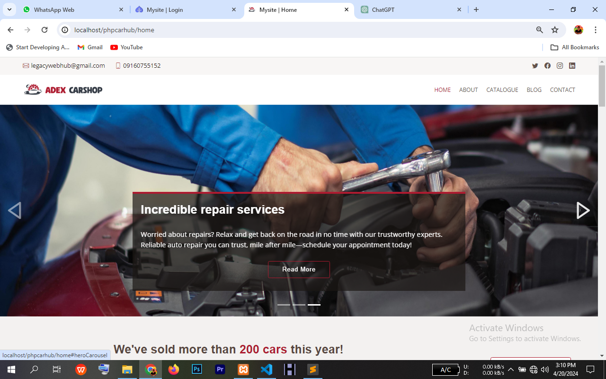
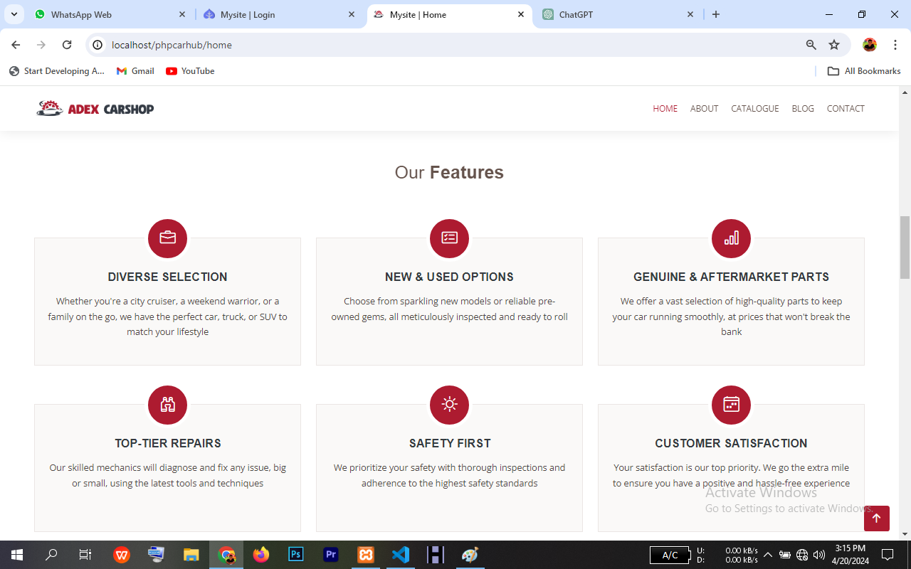
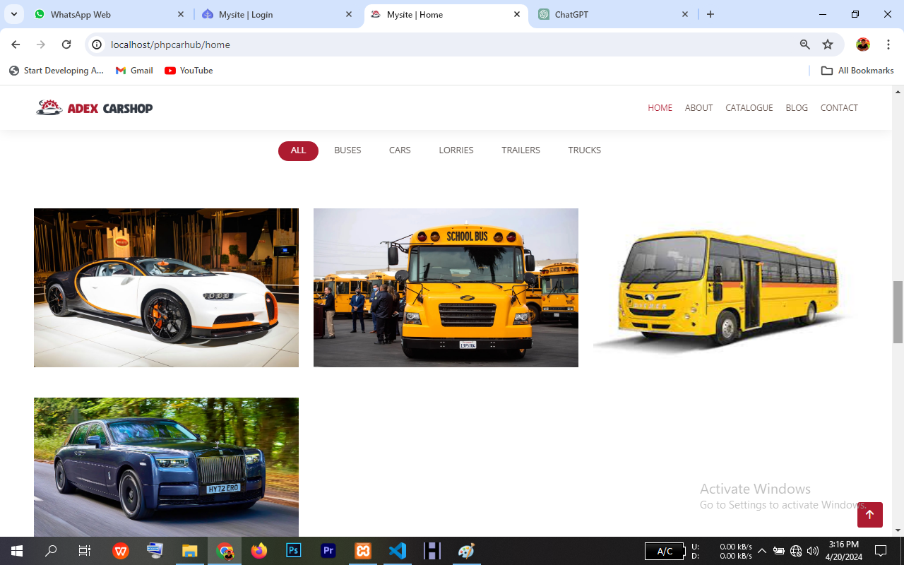
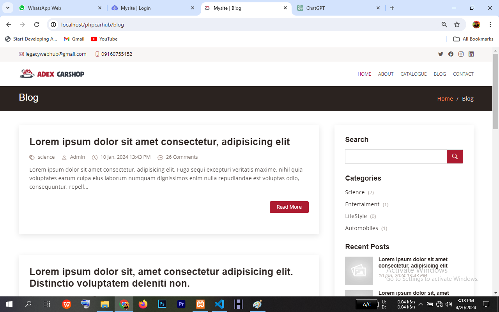
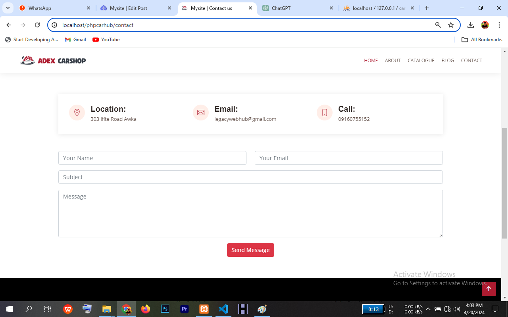
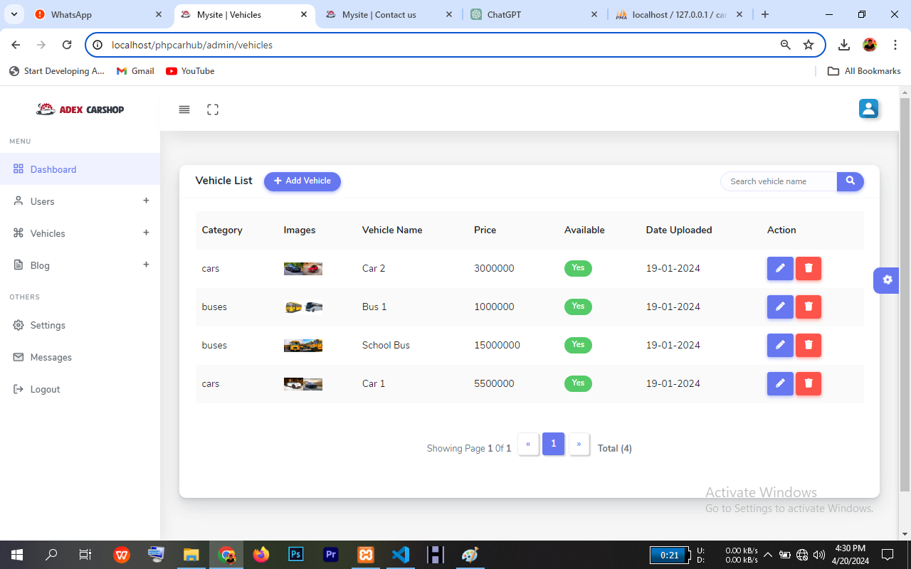
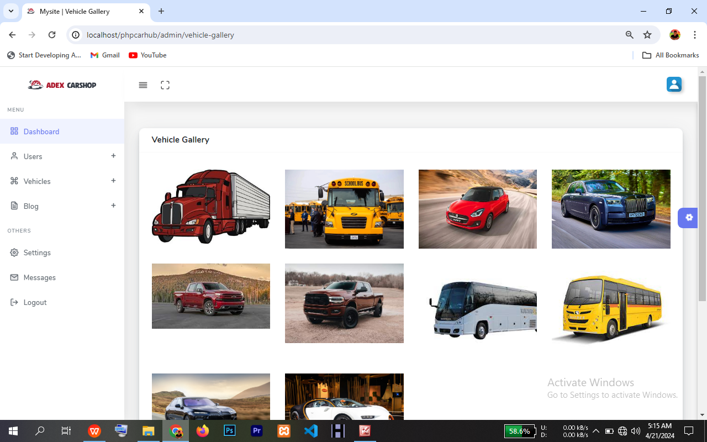

# About

This is an automobile management system built with Javascript, AJAX and PHP that offers all kinds of automobile sales, rentage, repair and consultation services.

# Features and Technical details

* Aimed to get the best file/folder structure possible by impementing .htaccess file for routing while following MVC structure where Controllers is separated from Views/Templates.

* To boost SEO, a blog was included in the project to help rank the website for keywords and phrases users search for. Users can also comment on posts or search post.

* Two Interface - Landing pages for users and Admin panel for managing settings, automobile and blog posts by admin.

* CRUD for interacting and managing the database models.

* Email uses html templates for nice and professional formatting

* AJAX was utilised to improve user experience

* Error pages for invalid url paths

# Technologies

* Vanilla Javascript
* Ajax
* PHP 8.2.4 (Xampp 8.2.0)
* PHPMailer v6.8.1
* Flattern template
* Otila Admin template

# Project shots

